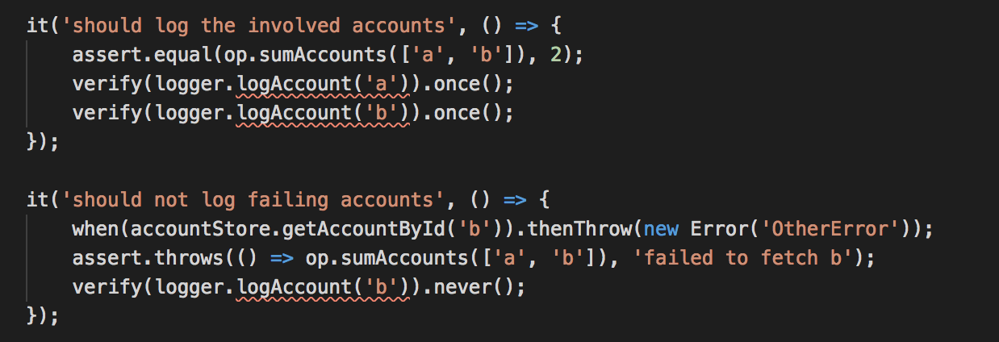
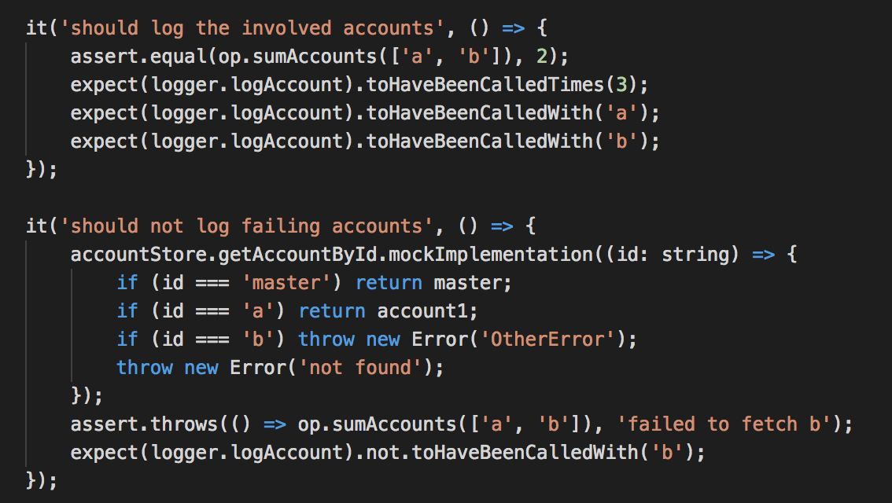

# Comparing ts-mockito vs jest

The purpose of this text is to compare two different libraries for mocking, `ts-mockito` and `jest`. To do the comparison, I will implement a simple example, and add tests using both libraries.

## Comparison

### First implementation, should sum a number of accounts

Let's start with a simple example. I have an `AccountStore` class, that stores all my accounts, and an `Account` class, that keeps the balance of a single account.

Next I'm adding a business logic class, `AccountOperation`, that has the ability to sum up the total balance of my accounts. This is the class that is the focus of this topic, that I will implement and test.

Each step in this text can be viewed as a commit [here](https://github.com/johanblumenberg-symphony/ts-mockito-vs-jest/commits/master).

First I add some interfaces:

`src/AccountOperation.ts`

```ts
export interface AccountOperation {
    sumAccounts(accountIds: string[]): number;
}
```

`src/AccountStore.ts`

```ts
export interface Account {
    id: string;
    balance: number;
}

export interface AccountStore {
    getAccountById(id: string): Account;
}
```

Then I add a simple implementation, that has the ability to sum a number of accounts. It should read those accounts from the store, and sum their balances.

`src/impl/AccountOperationImpl.ts`

```ts
import { AccountOperation } from "../AccountOperation";
import { AccountStore, Account } from "../AccountStore";

export class AccountOperationImpl implements AccountOperation {
    constructor(private _store: AccountStore) {}

    sumAccounts(accountIds: string[]): number {
        let sum = 0;

        for (let id of accountIds ) {
            let account = this._store.getAccountById(id);
            sum += account.balance;
        }

        return sum;
    }
}
```

Next I add a test using `ts-mockito`. Nothing out of the ordinary. It imports the implementation I want to test, and creates mocks for all dependencies. Notice how easy the mocks are created, just a single call to `imock()`.

`test/ts-mockito/AccountOperation.spec.ts`

```ts
import * as assert from 'assert';
import { AccountOperation } from '../../src/AccountOperation';
import { AccountOperationImpl } from '../../src/impl/AccountOperationImpl';
import { AccountStore, Account } from '../../src/AccountStore';
import { imock, instance, when } from 'ts-mockito';

describe('ts-mockito', () => {
    let accountStore: AccountStore;
    let account1: Account;
    let account2: Account;
    let account3: Account;
    let op: AccountOperation;

    beforeEach(() => {
        account1 = imock();
        when(account1.id).thenReturn('a');
        when(account1.balance).thenReturn(1);
        account2 = imock();
        when(account2.id).thenReturn('b');
        when(account2.balance).thenReturn(1);
        account3 = imock();
        when(account3.id).thenReturn('c');
        when(account3.balance).thenReturn(1);

        accountStore = imock();
        when(accountStore.getAccountById('a')).thenReturn(instance(account1));
        when(accountStore.getAccountById('b')).thenReturn(instance(account2));
        when(accountStore.getAccountById('c')).thenReturn(instance(account3));

        op = new AccountOperationImpl(instance(accountStore));
    });

    it('should sum the balance of given accounts', () => {
        assert.equal(op.sumAccounts(['a', 'b', 'c']), 3);
    });
});
```

Then the tests for `jest`. It looks very much the same, but notice that you have to actually implement the interfaces you want to mock.

`test/jest/__mocks__/AccountStore.mock.ts`

```ts
import { AccountStore, Account } from "../../../src/AccountStore";

export class AccountStoreMock implements AccountStore {
    getAccountById = jest.fn<Account, [string]>();
}
```

`test/jest/__mocks__/Account.mock.ts`

```ts
import { Account } from '../../../src/AccountStore';

export class AccountMock implements Account {
    constructor(public id: string, public balance: number) {}
}
```

`test/jest/AccountOperation.spec.ts`

```ts
import * as assert from 'assert';
import { AccountOperation } from '../../src/AccountOperation';
import { AccountOperationImpl } from '../../src/impl/AccountOperationImpl';
import { AccountStoreMock } from './__mocks__/AccountStore.mock';
import { AccountMock } from './__mocks__/Account.mock';

describe('jest', () => {
    let accountStore: AccountStoreMock;
    let account1: AccountMock;
    let account2: AccountMock;
    let account3: AccountMock;
    let op: AccountOperation;

    beforeEach(() => {
        account1 = new AccountMock('a', 1);
        account2 = new AccountMock('b', 1);
        account3 = new AccountMock('c', 1);

        accountStore = new AccountStoreMock();
        accountStore.getAccountById.mockImplementation((id: string) => {
            if (id === 'a') return account1;
            if (id === 'b') return account2;
            if (id === 'c') return account3;
            throw new Error('not found');
        });

        op = new AccountOperationImpl(accountStore);
    });

    it('should sum the balance of given accounts', () => {
        assert.equal(op.sumAccounts(['a', 'b', 'c']), 3);
    });
});
```

### Exclude negative balances

Now I want to add a small requirement. I want to exclude negative balances from the sum. So I add the implementation and the tests for the new requirement.

The implementation can be seen [here](https://github.com/johanblumenberg-symphony/ts-mockito-vs-jest/commit/86c7a020e7927e2a8a49ac4b0f085dc384340935).

Below are the changes needed for the tests. Nothing strange here. I add a new requirement, and I add new tests. No need to change any of the existing tests, I just add the new one. Exactly as it should be.

`test/jest/AccountOperation.spec.ts`

```diff
     it('should sum the balance of given accounts', () => {
         assert.equal(op.sumAccounts(['a', 'b', 'c']), 3);
     });
+
+    it('should not include negative balances', () => {
+        account2.balance = -1;
+
+        assert.equal(op.sumAccounts(['a', 'b', 'c']), 2);
+    });
 });
```

`test/ts-mockito/AccountOperation.spec.ts`

```diff
     it('should sum the balance of given accounts', () => {
         assert.equal(op.sumAccounts(['a', 'b', 'c']), 3);
     });
+
+    it('should not include negative balances', () => {
+        when(account2.balance).thenReturn(-1);
+
+        assert.equal(op.sumAccounts(['a', 'b', 'c']), 2);
+    });
 });
```

### Retry on network errors

The next requirement is that I want to retry fetching accounts if there is a network error. But only for network errors, other errors should still cause the operation to throw.

The implementation can be seen [here](https://github.com/johanblumenberg-symphony/ts-mockito-vs-jest/commit/8a2a7dd81424583c661dea0d61607d53251c5dbd).

Below are the changes needed for the tests. It's still quite clean. No changes needed, just adding the new tests.

But you can see one important difference. The `jest` code has to duplicate a large part of the setup code, which is really irrelevant to the test. This is because `ts-mockito` provides a much more flexible mock object, where you can override exactly the method invocations you want. With `jest`, you can only provide a complete mock implementation for the complete method.

`test/ts-mockito/AccountOperation.spec.ts`

```diff
         assert.equal(op.sumAccounts(['a', 'b', 'c']), 2);
     });
+
+    it('should retry getting account on network failures', () => {
+        when(accountStore.getAccountById('b')).thenThrow(new Error('NetworkError')).thenReturn(instance(account1));
+        assert.equal(op.sumAccounts(['a', 'b', 'c']), 3);
+    });
+
+    it('should fail on other errors', () => {
+        when(accountStore.getAccountById('b')).thenThrow(new Error('OtherError'));
+        assert.throws(() => op.sumAccounts(['a', 'b', 'c']), 'failed to fetch b');
+    });
 });
```

`test/jest/AccountOperation.spec.ts`

```diff
 
         assert.equal(op.sumAccounts(['a', 'b', 'c']), 2);
     });
+
+    it('should retry getting account on network failures', () => {
+        let first = true;
+        accountStore.getAccountById.mockImplementation((id: string) => {
+            if (id === 'a') return account1;
+            if (id === 'b' && first) { first = false; throw new Error('NetworkError'); }
+            if (id === 'b' && !first) return account2;
+            if (id === 'c') return account3;
+            throw new Error('not found');
+        });
+        assert.equal(op.sumAccounts(['a', 'b', 'c']), 3);
+    });
+
+    it('should fail on other errors', () => {
+        accountStore.getAccountById.mockImplementation((id: string) => {
+            if (id === 'a') return account1;
+            if (id === 'b') throw new Error('OtherError');
+            if (id === 'c') return account3;
+            throw new Error('not found');
+        });
+        assert.throws(() => op.sumAccounts(['a', 'b', 'c']));
+    });
 });
```

### Add logger

Next I want to add a logging service, to log every access to an account.

So I add a new interface for the logger.

`src/Logger.ts`

```ts
export interface Logger {
    logAccount(id: string);
}
```

The implementation can be seen [here](https://github.com/johanblumenberg-symphony/ts-mockito-vs-jest/commit/ee05565873279bf2e61581e594296901246da7cc).

Below are the changes needed for the tests. Notice that for jest we need to add a new mock implementation again to be able to mock the new interface, but in `ts-mockito` it's created dynamically from a call to `imock()`.

The mock implementation for `jest` is a bit more cumbersome, we have to duplicate some setup code again.

Notice also the difference in how call invocations are verified. Using `ts-mockito` it is possible to verify that the `logAccount` was invoked exactly once with the argument `'a'`, and once with the argument `'b'`. Using `jest` you need two calls, one to verify the argument, and one to verify the number of invocations. We'll see later how this can bite us.

`test/ts-mockito/AccountOperation.spec.ts`

```diff
 import { AccountOperation } from '../../src/AccountOperation';
 import { AccountOperationImpl } from '../../src/impl/AccountOperationImpl';
 import { AccountStore, Account } from '../../src/AccountStore';
-import { imock, instance, when } from 'ts-mockito';
+import { Logger } from '../../src/Logger';
+import { imock, instance, when, verify } from 'ts-mockito';
 
 describe('ts-mockito', () => {
     let accountStore: AccountStore;
     let account1: Account;
     let account2: Account;
     let account3: Account;
+    let logger: Logger;
     let op: AccountOperation;
 
     beforeEach(() => {
@@ -27,7 +29,9 @@ describe('ts-mockito', () => {
         when(accountStore.getAccountById('b')).thenReturn(instance(account2));
         when(accountStore.getAccountById('c')).thenReturn(instance(account3));
 
-        op = new AccountOperationImpl(instance(accountStore));
+        logger = imock();
+
+        op = new AccountOperationImpl(instance(accountStore), instance(logger));
     });
 
     it('should sum the balance of given accounts', () => {
@@ -49,4 +53,16 @@ describe('ts-mockito', () => {
         when(accountStore.getAccountById('b')).thenThrow(new Error('OtherError'));
         assert.throws(() => op.sumAccounts(['a', 'b', 'c']), 'failed to fetch b');
     });
+
+    it('should log the involved accounts', () => {
+        assert.equal(op.sumAccounts(['a', 'b']), 2);
+        verify(logger.logAccount('a')).once();
+        verify(logger.logAccount('b')).once();
+    });
+
+    it('should not log failing accounts', () => {
+        when(accountStore.getAccountById('b')).thenThrow(new Error('OtherError'));
+        assert.throws(() => op.sumAccounts(['a', 'b']), 'failed to fetch b');
+        verify(logger.logAccount('b')).never();
+    });
 });
```

`test/jest/__mocks__/Logger.mock.ts`

```ts
import { Logger } from "../../../src/Logger";

export class LoggerMock implements Logger {
    logAccount = jest.fn<void, [string]>();
}
```

`test/jest/AccountOperation.spec.ts`

```diff
 import { AccountOperationImpl } from '../../src/impl/AccountOperationImpl';
 import { AccountStoreMock } from './__mocks__/AccountStore.mock';
 import { AccountMock } from './__mocks__/Account.mock';
+import { LoggerMock } from './__mocks__/Logger.mock';
 
 describe('jest', () => {
     let accountStore: AccountStoreMock;
     let account1: AccountMock;
     let account2: AccountMock;
     let account3: AccountMock;
+    let logger: LoggerMock;
     let op: AccountOperation;
 
     beforeEach(() => {
@@ -24,7 +26,9 @@ describe('jest', () => {
             throw new Error('not found');
         });
 
-        op = new AccountOperationImpl(accountStore);
+        logger = new LoggerMock();
+
+        op = new AccountOperationImpl(accountStore, logger);
     });
 
     it('should sum the balance of given accounts', () => {
@@ -58,4 +62,21 @@ describe('jest', () => {
         });
         assert.throws(() => op.sumAccounts(['a', 'b', 'c']));
     });
+
+    it('should log the involved accounts', () => {
+        assert.equal(op.sumAccounts(['a', 'b']), 2);
+        expect(logger.logAccount).toHaveBeenCalledTimes(2);
+        expect(logger.logAccount).toHaveBeenCalledWith('a');
+        expect(logger.logAccount).toHaveBeenCalledWith('b');
+    });
+
+    it('should not log failing accounts', () => {
+        accountStore.getAccountById.mockImplementation((id: string) => {
+            if (id === 'a') return account1;
+            if (id === 'b') throw new Error('OtherError');
+            throw new Error('not found');
+        });
+        assert.throws(() => op.sumAccounts(['a', 'b']), 'failed to fetch b');
+        expect(logger.logAccount).not.toHaveBeenCalledWith('b');
+    });
 });
```

### Add methods to interface

Now, this logger service is also being used by other modules in the application. They want to log other things, so the `Logger` interface is extended.

`src/Logger.ts`

```diff
 export interface Logger {
     logAccount(id: string);
+
+    logUser(id: string): void;
+    logChair(): void;
+    logHouse(): void;
+    logExtra(): void;
+    logOver(): void;
+    logUnder(): void;
 }
```

Notice that the tests using `ts-mockito` does not need to be changed, but the tests using `jest` do. Because `jest` requires you to create an implementation of the interfaces you want to mock, and you need to update those implementations for every change in any interface, even if those changes are irrelevant for your code.

`test/jest/__mocks__/Logger.mock.ts`

```diff
 export class LoggerMock implements Logger {
     logAccount = jest.fn<void, [string]>();
+
+    logUser = jest.fn<void, [string]>();
+    logChair = jest.fn<void, []>();
+    logHouse = jest.fn<void, []>();
+    logExtra = jest.fn<void, []>();
+    logOver = jest.fn<void, []>();
+    logUnder = jest.fn<void, []>();
 }
```

### Add master account

The next requirement is that I want all sums to include the balance from my master account.

The change in the implementation is simple.

`src/impl/AccountOperationImpl.ts`

```diff
     sumAccounts(accountIds: string[]): number {
         let sum = 0;
 
-        for (let id of accountIds ) {
+        for (let id of [ 'master', ...accountIds ]) {
             let account = this.getAccountWithRetry(id);
             this._logger.logAccount(id);
```

Below are the changes needed for the tests. For the tests written using `ts-mockito`, all that is required is to add some setup code, and add the new test. But if you look at the tests using `jest`, almost all tests have to be changed.

All tests that duplicated the setup code now have to be updated, even if those tests are not really affected by the new code.

The test that is verifying the number of invocations also changed. There is no longer any way to verify that the logging was invoked exactly once with the argument `'a'`, because the invocation count includes all invocations of the method, regardless of arguments.

`test/ts-mockito/AccountOperation.spec.ts`

```diff
@@ -7,6 +7,7 @@ import { imock, instance, when, verify } from 'ts-mockito';
 
 describe('ts-mockito', () => {
     let accountStore: AccountStore;
+    let master: Account;
     let account1: Account;
     let account2: Account;
     let account3: Account;
@@ -14,6 +15,9 @@ describe('ts-mockito', () => {
     let op: AccountOperation;
 
     beforeEach(() => {
+        master = imock();
+        when(master.id).thenReturn('master');
+        when(master.balance).thenReturn(0);
         account1 = imock();
         when(account1.id).thenReturn('a');
         when(account1.balance).thenReturn(1);
@@ -25,6 +29,7 @@ describe('ts-mockito', () => {
         when(account3.balance).thenReturn(1);
 
         accountStore = imock();
+        when(accountStore.getAccountById('master')).thenReturn(instance(master));
         when(accountStore.getAccountById('a')).thenReturn(instance(account1));
         when(accountStore.getAccountById('b')).thenReturn(instance(account2));
         when(accountStore.getAccountById('c')).thenReturn(instance(account3));
@@ -65,4 +70,9 @@ describe('ts-mockito', () => {
         assert.throws(() => op.sumAccounts(['a', 'b']), 'failed to fetch b');
         verify(logger.logAccount('b')).never();
     });
+
+    it('should always add the master account', () => {
+        when(master.balance).thenReturn(1);
+        assert.equal(op.sumAccounts(['a', 'b', 'c']), 4);
+    });
 });
```

`test/jest/AccountOperation.spec.ts`

```diff
@@ -7,6 +7,7 @@ import { LoggerMock } from './__mocks__/Logger.mock';
 
 describe('jest', () => {
     let accountStore: AccountStoreMock;
+    let master: AccountMock;
     let account1: AccountMock;
     let account2: AccountMock;
     let account3: AccountMock;
@@ -14,12 +15,14 @@ describe('jest', () => {
     let op: AccountOperation;
 
     beforeEach(() => {
+        master = new AccountMock('master', 0);
         account1 = new AccountMock('a', 1);
         account2 = new AccountMock('b', 1);
         account3 = new AccountMock('c', 1);
 
         accountStore = new AccountStoreMock();
         accountStore.getAccountById.mockImplementation((id: string) => {
+            if (id === 'master') return master;
             if (id === 'a') return account1;
             if (id === 'b') return account2;
             if (id === 'c') return account3;
@@ -44,6 +47,7 @@ describe('jest', () => {
     it('should retry getting account on network failures', () => {
         let first = true;
         accountStore.getAccountById.mockImplementation((id: string) => {
+            if (id === 'master') return master;
             if (id === 'a') return account1;
             if (id === 'b' && first) { first = false; throw new Error('NetworkError'); }
             if (id === 'b' && !first) return account2;
@@ -55,6 +59,7 @@ describe('jest', () => {
 
     it('should fail on other errors', () => {
         accountStore.getAccountById.mockImplementation((id: string) => {
+            if (id === 'master') return master;
             if (id === 'a') return account1;
             if (id === 'b') throw new Error('OtherError');
             if (id === 'c') return account3;
@@ -65,13 +70,14 @@ describe('jest', () => {
 
     it('should log the involved accounts', () => {
         assert.equal(op.sumAccounts(['a', 'b']), 2);
-        expect(logger.logAccount).toHaveBeenCalledTimes(2);
+        expect(logger.logAccount).toHaveBeenCalledTimes(3);
         expect(logger.logAccount).toHaveBeenCalledWith('a');
         expect(logger.logAccount).toHaveBeenCalledWith('b');
     });
 
     it('should not log failing accounts', () => {
         accountStore.getAccountById.mockImplementation((id: string) => {
+            if (id === 'master') return master;
             if (id === 'a') return account1;
             if (id === 'b') throw new Error('OtherError');
             throw new Error('not found');
@@ -79,4 +85,9 @@ describe('jest', () => {
         assert.throws(() => op.sumAccounts(['a', 'b']), 'failed to fetch b');
         expect(logger.logAccount).not.toHaveBeenCalledWith('b');
     });
+
+    it('should always add the master account', () => {
+        master.balance = 1;
+        assert.equal(op.sumAccounts(['a', 'b', 'c']), 4);
+    });
 });
```

### Change Logger interface

Next I want to change how access to accounts are logged. I want to log both the ID of the account, and the ID of the master account.

So I update the interface.

`src/Logger.ts`

```diff
 export interface Logger {
-    logAccount(id: string);
+    logAccount(master: string, id: string);
 
     logUser(id: string): void;
     logChair(): void;
```

Now let's see how the compiler can help us. Let's take a look at the tests.

In the tests that are using `ts-mockito` you can clearly see where the tests need to be updated. The compiler is marking with red where your code is broken. If you look at the tests using `jest`, there is no such help. We have to manually figure out what needs to be updated.

`test/ts-mockito/AccountOperation.spec.ts`



`test/jest/AccountOperation.spec.ts`



So let's start with updating the `ts-mockito` tests, since that is simple.

`test/ts-mockito/AccountOperation.spec.ts`

```diff
 
     it('should log the involved accounts', () => {
         assert.equal(op.sumAccounts(['a', 'b']), 2);
-        verify(logger.logAccount('a')).once();
-        verify(logger.logAccount('b')).once();
+        verify(logger.logAccount('a', 'master')).once();
+        verify(logger.logAccount('b', 'master')).once();
     });
 
     it('should not log failing accounts', () => {
         when(accountStore.getAccountById('b')).thenThrow(new Error('OtherError'));
         assert.throws(() => op.sumAccounts(['a', 'b']), 'failed to fetch b');
-        verify(logger.logAccount('b')).never();
+        verify(logger.logAccount('b', 'master')).never();
     });
```

Next, let's run the tests to see if anything is broken.

```bash
~/code/ts-mockito-vs-jest [master] $ yarn test
yarn run v1.19.1
$ jest
 FAIL  test/jest/AccountOperation.spec.ts

  ● jest › should log the involved accounts

    expect(jest.fn()).toHaveBeenCalledWith(...expected)

    Expected: "a"
    Received
           1: "master", "master"
           2: "a", "master"
           3: "b", "master"

    Number of calls: 3

      72 |         assert.equal(op.sumAccounts(['a', 'b']), 2);
      73 |         expect(logger.logAccount).toHaveBeenCalledTimes(3);
    > 74 |         expect(logger.logAccount).toHaveBeenCalledWith('a');
         |                                   ^
      75 |         expect(logger.logAccount).toHaveBeenCalledWith('b');
      76 |     });
      77 | 

      at Object.<anonymous> (test/jest/AccountOperation.spec.ts:74:35)

 PASS  test/ts-mockito/AccountOperation.spec.ts

Test Suites: 1 failed, 1 passed, 2 total
Tests:       1 failed, 13 passed, 14 total
Snapshots:   0 total
Time:        2.952s
```

As expected, the test `should log the involved accounts` is failing, because we expect it to be invoked with `'a'` as an argument, but the interface was updated to require two arguments. So let's fix that.

`test/jest/AccountOperation.spec.ts`

```diff
     it('should log the involved accounts', () => {
         assert.equal(op.sumAccounts(['a', 'b']), 2);
         expect(logger.logAccount).toHaveBeenCalledTimes(3);
-        expect(logger.logAccount).toHaveBeenCalledWith('a');
-        expect(logger.logAccount).toHaveBeenCalledWith('b');
+        expect(logger.logAccount).toHaveBeenCalledWith('a', 'master');
+        expect(logger.logAccount).toHaveBeenCalledWith('b', 'master');
     });
```

But wait a minute. The tests using `ts-mockito` showed that there were two tests that needed to be updated. But there was only one test that was failing. Shouldn't we update this test as well?

```ts
    it('should not log failing accounts', () => {
        accountStore.getAccountById.mockImplementation((id: string) => {
            if (id === 'master') return master;
            if (id === 'a') return account1;
            if (id === 'b') throw new Error('OtherError');
            throw new Error('not found');
        });
        assert.throws(() => op.sumAccounts(['a', 'b']), 'failed to fetch b');
        expect(logger.logAccount).not.toHaveBeenCalledWith('b');
    });
```

The problem here is that the tests is verifying that the `logAccount` method is never invoked with only `'b'` as argument. This will clearly always be true, since the method now requires two arguments.

So the test is broken. It no longer tests what it was supposed to test.

Let's see if we can introduce a bug, and see what happens. Switching the lines below, will make the account id to be logged even if fetching that account throws an exception. Exactly what the test above is supposed to test.

`src/impl/AccountOperationImpl.ts`

```diff
         let sum = 0;
 
         for (let id of [ 'master', ...accountIds ]) {
+            this._logger.logAccount(id, 'master');
             let account = this.getAccountWithRetry(id);
-            this._logger.logAccount(id, 'master');
             if (account.balance > 0) {
                 sum += account.balance;
             }
```

Let's run the tests and see what happens. The test that is using `ts-mockito` correctly identifies the bug. But the bug slips through the test that is using `jest`. Even though the test was designed to find exactly this bug.

```bash
~/code/ts-mockito-vs-jest [tmp] $ yarn test
yarn run v1.19.1
$ jest
 FAIL  test/ts-mockito/AccountOperation.spec.ts

  ● ts-mockito › should not log failing accounts

    Expected "logAccount(strictEqual(b), strictEqual(master))" to be called 0 time(s). But has been called 1 time(s).

      69 |         when(accountStore.getAccountById('b')).thenThrow(new Error('OtherError'));
      70 |         assert.throws(() => op.sumAccounts(['a', 'b']), 'failed to fetch b');
    > 71 |         verify(logger.logAccount('b', 'master')).never();
         |                                                  ^
      72 |     });
      73 | 
      74 |     it('should always add the master account', () => {

      at MethodStubVerificator.Object.<anonymous>.MethodStubVerificator.times (node_modules/ts-mockito/src/MethodStubVerificator.ts:38:19)
      at Object.<anonymous> (test/ts-mockito/AccountOperation.spec.ts:71:50)

 PASS  test/jest/AccountOperation.spec.ts

Test Suites: 1 failed, 1 passed, 2 total
Tests:       1 failed, 13 passed, 14 total
Snapshots:   0 total
Time:        2.345s
```

## Summary

 * `ts-mockito` is strongly typed. This helps you to keep your tests up to date and avoids manual work to find all places that needs to be changed.
 * `ts-mockito` enables you to write more independent tests. This is important, because every time you change a test to match your implementation, you are at the risk of introducing a bug.
 * `ts-mockito` has a more flexible interface, that helps you to write more concise test code.